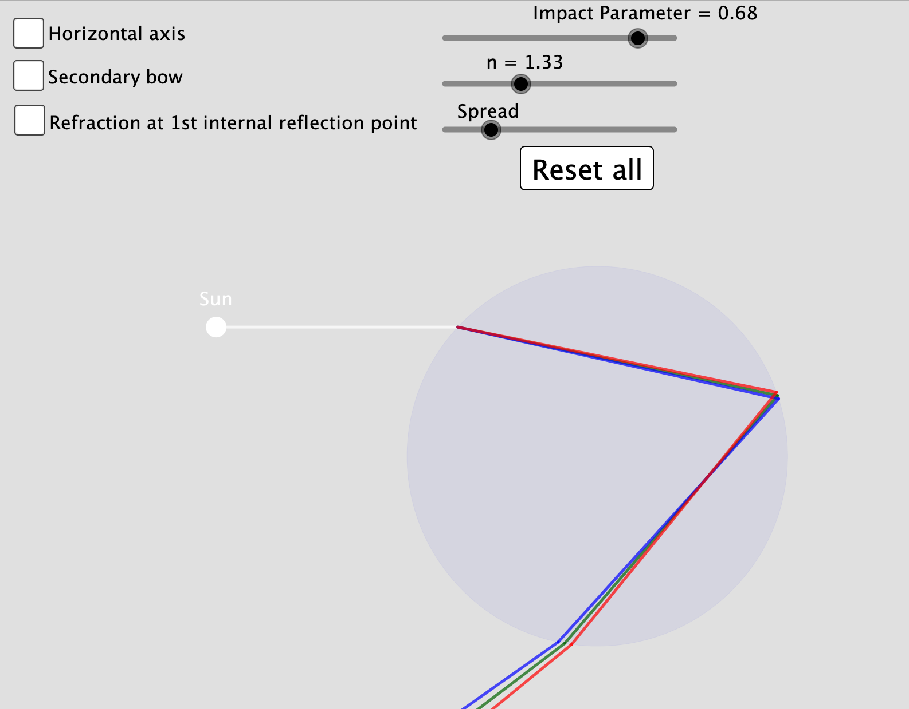

# Descartes Theory of Rainbow Formation
This GeoGebra simulation shows how rainbows are formed from a simple geometric optics perspective. More information can be found on my [blog](https://spectroscopycafe.github.io/light/bites/2021/01/23/rainbows-and-rays.html) or on [GeoGebra](https://www.geogebra.org/m/c5bdaahj).

